# Firebase API Integration Diagram

## Code Sprout - Firebase Backend Integration Architecture

This document provides a comprehensive overview of how the Code Sprout Flutter application integrates with Firebase services, detailing authentication flows, data synchronization, caching strategies, and real-time operations.

---

## Firebase Integration Architecture Diagram

```mermaid
---
config:
  layout: elk
---
flowchart LR
 subgraph UI["**User Interface**"]
    direction TB
        LoginPage@{ label: "`Login Page`" }
        RegisterPage@{ label: "`Register Page`" }
        SettingsPage@{ label: "`Settings Page`" }
        HomePage@{ label: "`Home Page`" }
        CoursePage@{ label: "`Course Page`" }
        FarmPage@{ label: "`Farm Page`" }
        SproutPage@{ label: "`Sprout Page`" }
        AdminConfigPage@{ label: "`Admin Config Page`" }
  end
 subgraph APP["**App Logic & State**"]
        AuthStateListener(["Auth State Listener"])
        RouteGuard(["Route Guard"])
        ValueNotifier(["Value Notifier"])
  end
 subgraph SERVICES["**Service / Business Logic**"]
        AuthService(["Authentication Service"])
        FirestoreService(["Firestore Service"])
        FarmProgressService(["Farm Progress Service"])
        CodeFilesService(["Code Files Service"])
        LocalStorageService(["Local Storage Service"])
        HandleFarmProgress(["Farm Progress Handler"])
        HandleCodeFiles(["Code Files Handler"])
        HandleResearchProgress(["Research Progress Handler"])
        HandleResearchCompleted(["Research Completed Handler"])
  end
 subgraph MODELS["**Data Models & Cache**"]
        UserDataModel(["User Data Model"])
        FarmDataModel(["Farm Data Model"])
        CodeFilesModel(["Code Files Model"])
        ResearchDataModel(["Research Data Model"])
        UserDataSchema(["User Data Schema"])
        FarmDataSchema(["Farm Data Schema"])
        ResearchItemsSchema(["Research Items Schema"])
        UserDataCache(["User Data Cache"])
        SyncTimestamp(["Sync Timestamp"])
        SecureStorage(["Flutter Secure Storage"])
  end
 subgraph PLATFORM["**Firebase Platform**"]
        FirebaseCore(["Firebase Core"])
        FirebaseAuth(["Firebase Auth"])
        FirebaseOptions(["Firebase Options"])
        CloudFirestore(["Cloud Firestore"])
        FirestoreAPI(["Firestore API"])
        SecurityRules(["Security Rules"])
        UserAuthentication(["User Authentication"])
        DataValidation(["Data Validation"])
  end
 subgraph FIRESTOREDATA["**Firestore Collections & Docs**"]
        UsersCollection(["users/ Collection"])
        UserDocument(["users/{userId} Doc"])
        FarmProgressCollection(["farmProgress Subcol"])
        CodeFilesCollection(["codeFiles Subcol"])
        GridDoc(["farmProgress/grid Doc"])
        ResearchDoc(["farmProgress/research Doc"])
        PythonFiles(["codeFiles/python Doc"])
        JavaFiles(["codeFiles/java Doc"])
        JSFiles(["codeFiles/js Doc"])
        CppFiles(["codeFiles/cpp Doc"])
        CSharpFiles(["codeFiles/csharp Doc"])
  end
 subgraph NETWORK["**Network & Sync**"]
        OnlineMode(["Online Mode"])
        OfflineMode(["Offline Mode"])
        NetworkDetection(["Network Detection"])
        CacheFirst(["Cache-First Strategy"])
        WriteThroughCache(["Write-Through Cache"])
        OptimisticUpdate(["Optimistic Update"])
        BackgroundSync(["Background Sync"])
  end
 subgraph ERRORS["**Error & Validation**"]
        AuthErrors(["Auth Errors"])
        FirestoreErrors(["Firestore Errors"])
        NetworkErrors(["Network Errors"])
        ValidationErrors(["Validation Errors"])
  end
 subgraph PCFG["**Platform Config**"]
        WebConfig(["Web Platform"])
        AndroidConfig(["Android Platform"])
        IOSConfig(["iOS Platform"])
  end
 subgraph AUTHMETHODS["**Auth Methods**"]
        EmailPasswordAuth(["Email/Password"])
        UserManagement(["User Mgmt"])
        SessionManagement(["Session Mgmt"])
        TokenManagement(["Token Mgmt"])
        SignIn(["Sign In"])
        SignUp(["Sign Up"])
        SignOut(["Sign Out"])
        UpdateEmail(["Update Email"])
        UpdatePassword(["Update Password"])
        DeleteUser(["Delete User"])
        CurrentUser(["Current User"])
        UserToken(["ID Token"])
        AuthStateStream(["Auth State changes"])
        AuthAPI(["Auth API"])
  end
    LoginPage -- login --> AuthService
    RegisterPage -- register --> AuthService
    SettingsPage --> AuthService
    HomePage --> FirestoreService
    CoursePage --> FirestoreService
    FarmPage --> HandleFarmProgress & HandleCodeFiles
    SproutPage --> HandleResearchProgress
    AdminConfigPage -- schema edit --> FirestoreService & UserDataSchema & FarmDataSchema
    AuthService -- sign in/sign up --> SignIn & SignUp & SignOut
    SignIn -- email --> EmailPasswordAuth
    SignUp -- email --> EmailPasswordAuth & UserManagement
    AuthService --> FirestoreService
    FirestoreService --> UsersCollection & GetDocument["GetDocument"] & SetDocument["SetDocument"] & UpdateDocument["UpdateDocument"] & QueryCollection["QueryCollection"] & LocalStorageService
    LocalStorageService --> UserDataCache & SecureStorage & SyncTimestamp & ValueNotifier
    UsersCollection --> UserDocument
    UserDocument --> FarmProgressCollection & CodeFilesCollection
    FarmProgressCollection --> GridDoc & ResearchDoc
    CodeFilesCollection --> PythonFiles & JavaFiles & JSFiles & CppFiles & CSharpFiles
    HandleFarmProgress --> FarmProgressService
    FarmProgressService --> FarmDataModel & FarmProgressCollection & GetDocument & SetDocument
    HandleCodeFiles --> CodeFilesService
    CodeFilesService --> CodeFilesModel & CodeFilesCollection & GetDocument & SetDocument
    HandleResearchProgress --> ResearchDataModel & FirestoreService
    ResearchDataModel --> ResearchItemsSchema
    UserDataModel --> UserDataSchema
    NetworkDetection --> OnlineMode & OfflineMode
    OnlineMode --> FirestoreAPI
    OfflineMode --> UserDataCache
    CacheFirst --> LocalStorageService
    BackgroundSync --> FirestoreAPI
    WriteThroughCache --> FirestoreAPI & BackgroundSync
    AuthAPI --> CurrentUser & TokenManagement
    TokenManagement --> UserToken
    UserToken --> FirestoreAPI
    CurrentUser --> AuthStateStream
    AuthStateStream --> AuthStateListener
    AuthStateListener --> RouteGuard
    RouteGuard --> HomePage & CoursePage & FarmPage & SproutPage
    FirestoreAPI --> SecurityRules & FirestoreErrors
    SecurityRules --> UserAuthentication & DataValidation
    DataValidation --> ValidationErrors
    UserAuthentication --> CurrentUser
    AuthErrors --> AuthService
    FirestoreErrors --> FirestoreService
    NetworkErrors --> FirestoreService
    ValidationErrors --> FirestoreService
    FirebaseCore --> FirebaseOptions & FirebaseAuth & CloudFirestore & FirestoreAPI
    FirebaseOptions --> WebConfig & AndroidConfig & IOSConfig
    UI --> APP
    APP --> SERVICES
    SERVICES --> MODELS & NETWORK
    MODELS --> FIRESTOREDATA
    FIRESTOREDATA --> PLATFORM
    PLATFORM --> ERRORS

    LoginPage@{ shape: stadium}
    RegisterPage@{ shape: stadium}
    SettingsPage@{ shape: stadium}
    HomePage@{ shape: stadium}
    CoursePage@{ shape: stadium}
    FarmPage@{ shape: stadium}
    SproutPage@{ shape: stadium}
    AdminConfigPage@{ shape: stadium}
     LoginPage:::uiClass
     RegisterPage:::uiClass
     SettingsPage:::uiClass
     HomePage:::uiClass
     CoursePage:::uiClass
     FarmPage:::uiClass
     SproutPage:::uiClass
     AdminConfigPage:::uiClass
     AuthStateListener:::serviceClass
     RouteGuard:::serviceClass
     ValueNotifier:::cacheClass
     AuthService:::serviceClass
     FirestoreService:::serviceClass
     FarmProgressService:::serviceClass
     CodeFilesService:::serviceClass
     LocalStorageService:::cacheClass
     HandleFarmProgress:::serviceClass
     HandleCodeFiles:::serviceClass
     HandleResearchProgress:::serviceClass
     HandleResearchCompleted:::serviceClass
     UserDataModel:::dataClass
     FarmDataModel:::dataClass
     CodeFilesModel:::dataClass
     ResearchDataModel:::dataClass
     UserDataSchema:::dataClass
     FarmDataSchema:::dataClass
     ResearchItemsSchema:::dataClass
     UserDataCache:::cacheClass
     SyncTimestamp:::cacheClass
     SecureStorage:::cacheClass
     FirebaseCore:::firebaseClass
     FirebaseAuth:::authClass
     FirebaseOptions:::firebaseClass
     CloudFirestore:::firestoreClass
     FirestoreAPI:::firestoreClass
     SecurityRules:::firestoreClass
     UserAuthentication:::authClass
     DataValidation:::firestoreClass
     UsersCollection:::firestoreClass
     UserDocument:::firestoreClass
     FarmProgressCollection:::firestoreClass
     CodeFilesCollection:::firestoreClass
     GridDoc:::firestoreClass
     ResearchDoc:::firestoreClass
     PythonFiles:::firestoreClass
     JavaFiles:::firestoreClass
     JSFiles:::firestoreClass
     CppFiles:::firestoreClass
     CSharpFiles:::firestoreClass
     OnlineMode:::networkClass
     OfflineMode:::networkClass
     NetworkDetection:::networkClass
     CacheFirst:::cacheClass
     WriteThroughCache:::cacheClass
     OptimisticUpdate:::networkClass
     BackgroundSync:::networkClass
     AuthErrors:::authClass
     FirestoreErrors:::firestoreClass
     NetworkErrors:::networkClass
     ValidationErrors:::dataClass
     WebConfig:::platformClass
     AndroidConfig:::platformClass
     IOSConfig:::platformClass
     EmailPasswordAuth:::authClass
     UserManagement:::authClass
     SessionManagement:::authClass
     TokenManagement:::authClass
     SignIn:::authClass
     SignUp:::authClass
     SignOut:::authClass
     UpdateEmail:::authClass
     UpdatePassword:::authClass
     DeleteUser:::authClass
     CurrentUser:::authClass
     UserToken:::authClass
     AuthStateStream:::authClass
     AuthAPI:::authClass
    classDef uiClass fill:#4A90E2,stroke:#2E5C8A,stroke-width:2px,color:#fff
    classDef serviceClass fill:#43ac6a,stroke:#267743,stroke-width:2px,color:#fff
    classDef dataClass fill:#F39C12,stroke:#C87F0A,stroke-width:2px,color:#fff
    classDef cacheClass fill:#9B59B6,stroke:#6C3483,stroke-width:2px,color:#fff
    classDef firebaseClass fill:#FFA500,stroke:#DA9100,stroke-width:3px,color:#fff
    classDef authClass fill:#E74C3C,stroke:#A93226,stroke-width:2px,color:#fff
    classDef firestoreClass fill:#3498DB,stroke:#21618C,stroke-width:2px,color:#fff
    classDef networkClass fill:#1ABC9C,stroke:#138D75,stroke-width:2px,color:#fff
    classDef platformClass fill:#95A5A6,stroke:#707B7C,stroke-width:2px,color:#fff
```



---

## Architecture Overview

### 1. **Client Application Layer**
The client application consists of Flutter UI components that interact with Firebase through service abstractions:

- **UI Components**: User-facing pages for authentication, content browsing, and data management
- **Authentication Flow**: Stream-based auth state management and route protection

### 2. **Service Layer (Business Logic)**
Service classes provide abstraction over Firebase APIs and implement business logic:

- **Core Services**: Authentication, Firestore operations, farm progress, code files, and local storage
- **Data Handlers**: Specialized handlers for complex operations like farm progress and research management

### 3. **Data Models & Schemas**
Schema-driven data models ensure consistency and enable migration:

- **Data Models**: Type-safe representations of application data
- **Schemas**: Dynamic configuration for flexible data structures

### 4. **Local Storage Layer**
Secure local caching for offline support and performance optimization:

- **Flutter Secure Storage**: Encrypted storage for sensitive user data
- **Cache Structure**: Organized cache with synchronization timestamps and reactive updates

### 5. **Firebase Platform**
Complete Firebase backend integration:

- **Firebase SDK**: Core initialization and platform-specific configuration
- **Firebase Authentication**: User authentication and session management
- **Cloud Firestore**: NoSQL database with collections and security rules

### 6. **Network & Communication**
Intelligent networking with offline support and error handling:

- **Network Handling**: Online/offline detection and mode switching
- **Sync Strategies**: Cache-first reads, write-through updates, optimistic updates
- **Error Handling**: Comprehensive error categorization and recovery

---

## Authentication Flow

### User Registration Flow
1. User submits registration form via **Register Page**
2. **Auth Service** calls `createUserWithEmailAndPassword()`
3. **Firebase Authentication** creates auth user
4. **Auth Service** gets new user UID from `currentUser`
5. **Firestore Service** checks username availability via `where()` query
6. **Firestore Service** creates user document with `UserData.create()`
7. Document saved to `users/{userId}` collection
8. **Local Storage Service** caches user data in **Secure Storage**
9. **Auth State Stream** notifies listeners
10. **Route Guard** redirects to home page

### User Login Flow
1. User submits credentials via **Login Page**
2. **Auth Service** calls `signInWithEmailAndPassword()`
3. **Firebase Authentication** validates credentials
4. **Auth API** returns user with ID token
5. **Auth State Stream** emits user object
6. **Auth State Listener** triggers
7. **Firestore Service** loads user data with `getUserData()`
8. Check **Local Storage** cache first (cache-first strategy)
9. If cache miss or force refresh, fetch from **Firestore**
10. Cache result in **Local Storage Service**
11. **Value Notifier** triggers UI updates
12. **Route Guard** allows navigation to protected routes

### Session Management
- **Auth State Stream** (`authStateChanges()`) monitors authentication status
- **Current User** object provides access to UID and token
- **Token Management** handles automatic token refresh
- **Route Guard** protects pages requiring authentication
- Session persists across app restarts via Firebase SDK

### User Logout Flow
1. User clicks logout on **Settings Page**
2. **Auth Service** calls **Firestore Service** to clear cache
3. **Local Storage Service** deletes cached user data
4. **Value Notifier** emits null value
5. **Auth Service** calls `signOut()`
6. **Firebase Authentication** invalidates session token
7. **Auth State Stream** emits null
8. **Route Guard** redirects to login page

### Account Updates
- **Update Email**: `verifyBeforeUpdateEmail()` sends verification to new email
- **Update Password**: `updatePassword()` requires recent login
- **Update Username**: Direct Firestore update to `accountInformation.username`
- **Delete Account**: `delete()` removes auth user, manually delete Firestore data

---

## Firestore Data Structure

### Root Collection Structure
```
users/ (Collection)
├── {userId}/ (Document)
│   ├── accountInformation
│   │   ├── username: string
│   │   └── email: string (from auth)
│   ├── courseProgress
│   │   └── {language}.{difficulty}.{module}: {completion data}
│   ├── interaction
│   │   ├── hasLearnedChapter: boolean
│   │   └── hasAcceptedTerms: boolean
│   ├── inventory
│   │   └── {itemId}: quantity
│   ├── rank
│   │   ├── experience: number
│   │   └── level: number
│   ├── research
│   │   └── unlockedItems: array
│   ├── statistics
│   │   └── {various metrics}
│   ├── farmProgress/ (SubCollection)
│   │   ├── grid (Document)
│   │   │   ├── gridInfo: {x, y}
│   │   │   ├── dronePosition: {x, y}
│   │   │   └── plotInfo: {coordinates: plot data}
│   │   └── research (Document)
│   │       └── {research progress data}
│   └── codeFiles/ (SubCollection)
│       ├── python (Document)
│       │   └── {fileName: code}
│       ├── java (Document)
│       │   └── {fileName: code}
│       ├── javascript (Document)
│       │   └── {fileName: code}
│       ├── cpp (Document)
│       │   └── {fileName: code}
│       └── csharp (Document)
│           └── {fileName: code}
```

### Document Operations

#### User Data Operations
- **Create**: `UserData.create()` → `set()` to `users/{userId}`
- **Read**: `getUserData()` → `get()` from `users/{userId}` (cache-first)
- **Update**: `updateUserData()` → `update()` to `users/{userId}`
- **Delete**: `deleteUserDocument()` → `delete()` from `users/{userId}`
- **Query**: `usernameExists()` → `where('accountInformation.username', '==', value).limit(1)`

#### Farm Progress Operations
- **Save**: `saveFarmProgress()` → `set()` to `users/{userId}/farmProgress/grid`
- **Load**: `loadFarmProgress()` → `get()` from `users/{userId}/farmProgress/grid`
- **Check Exists**: `farmProgressExists()` → `get()` and check `exists`
- **Delete**: `deleteFarmProgress()` → `delete()` from `users/{userId}/farmProgress/grid`
- **Create Default**: `createDefaultProgress()` → `set()` with default values

#### Code Files Operations
- **Save**: `saveCodeFiles()` → `set()` to `users/{userId}/codeFiles/{languageId}`
- **Load**: `loadCodeFiles()` → `get()` from `users/{userId}/codeFiles/{languageId}`
- **Update Single**: `updateCodeFile()` → `update()` with `{fileName: code}`
- **Delete Language**: `deleteCodeFiles()` → `delete()` from `users/{userId}/codeFiles/{languageId}`
- **List Languages**: Query all documents in `users/{userId}/codeFiles/`

---

## Local Caching Strategy

### Cache-First Read Strategy
```
1. UI requests data via FirestoreService
2. Check LocalStorageService cache first
3. If cached data exists and valid:
   ├─ Return cached data immediately
   └─ UI updates instantly (fast UX)
4. If cache miss or forceRefresh=true:
   ├─ Fetch from Firestore
   ├─ Validate against schema
   ├─ Save to cache
   └─ Return fresh data
5. If Firestore fails:
   └─ Fallback to cached data (offline support)
```

### Write-Through Cache Strategy
```
1. UI updates data via service
2. Apply optimistic update to UI (immediate feedback)
3. Update LocalStorageService cache (local persistence)
4. ValueNotifier triggers reactive UI updates
5. Write to Firestore in background
6. If write succeeds:
   └─ Update sync timestamp
7. If write fails:
   ├─ Keep cached data
   ├─ Queue for retry
   └─ Show error notification
```

### Cache Structure
- **Key**: `cached_user_data`
- **Value**: JSON-encoded `UserData` object
- **Sync Key**: `last_sync_timestamp`
- **Encryption**: Flutter Secure Storage with platform-specific security
  - **Android**: `encryptedSharedPreferences`
  - **iOS**: Keychain with `first_unlock` accessibility

### Cache Validation
```dart
1. Load cached data
2. Deserialize to UserData object
3. Validate against current schema
4. If validation errors exist:
   ├─ Cache is outdated
   ├─ Fetch from Firestore
   ├─ Migrate data to current schema
   └─ Update cache
5. If validation passes:
   └─ Use cached data
```

### Cache Invalidation
- **On Logout**: Clear all cached data
- **On Schema Update**: Reload schema and migrate cached data
- **On Validation Error**: Re-fetch from Firestore
- **Manual Refresh**: `forceRefresh=true` parameter

---

## Synchronization Mechanisms

### Reactive State Management
- **ValueNotifier**: Emits cached `UserData` when updated
- **Listeners**: UI components subscribe to notifier
- **Automatic Updates**: UI reacts to cache changes without manual refresh
- **Cross-Page Sync**: Changes on one page reflect on all pages instantly

### Network Detection
```dart
1. Attempt Firestore operation
2. Timeout after 10 seconds
3. If timeout or network error:
   ├─ Switch to offline mode
   └─ Use cached data
4. If operation succeeds:
   ├─ Online mode active
   └─ Update cache
```

### Optimistic Updates
```dart
1. User performs action (e.g., update username)
2. Update UI immediately (optimistic)
3. Update local cache (persist locally)
4. Send update to Firestore asynchronously
5. If Firestore update fails:
   ├─ Revert UI change
   ├─ Show error message
   └─ Keep cached data for retry
6. If Firestore update succeeds:
   └─ Confirm success with timestamp
```

### Background Sync
- Operations queued when offline
- Automatic retry when connection restored
- Failed operations logged for debugging
- User notified of sync status

---

## Security Implementation

### Firebase Security Rules
```javascript
rules_version = '2';
service cloud.firestore {
  match /databases/{database}/documents {
    // Users can only access their own data
    match /users/{userId} {
      allow read, write: if request.auth != null && request.auth.uid == userId;
      
      // SubCollections inherit parent permissions
      match /farmProgress/{document=**} {
        allow read, write: if request.auth != null && request.auth.uid == userId;
      }
      
      match /codeFiles/{document=**} {
        allow read, write: if request.auth != null && request.auth.uid == userId;
      }
    }
  }
}
```

### Authentication Security
- **Email/Password**: Minimum 6 characters enforced by Firebase
- **Email Verification**: Optional but recommended for production
- **ID Tokens**: Automatically managed by Firebase SDK
- **Token Refresh**: Automatic refresh every hour
- **Session Persistence**: Configurable (local, session, none)

### Data Security
- **Local Encryption**: Flutter Secure Storage encrypts all cached data
- **HTTPS Only**: All Firebase API calls use TLS/SSL
- **API Key Protection**: API keys in `firebase_options.dart` are safe for client-side use
- **Firestore Rules**: Server-side validation prevents unauthorized access
- **Input Validation**: Schema validation before writes

---

## Error Handling

### Authentication Errors
| Error Code | Description | User Message |
|------------|-------------|--------------|
| `user-not-found` | No account with email | "No user found with this email." |
| `wrong-password` | Invalid password | "Incorrect password." |
| `invalid-email` | Malformed email | "Invalid email address." |
| `user-disabled` | Account disabled | "This account has been disabled." |
| `invalid-credential` | Generic auth error | "Invalid email or password." |
| `weak-password` | Password too short | "Password is too weak. Use at least 6 characters." |
| `email-already-in-use` | Email already registered | "An account already exists with this email." |
| `requires-recent-login` | Sensitive operation needs re-auth | "Please log out and log back in to change your password." |

### Firestore Errors
| Error Type | Description | Recovery Strategy |
|------------|-------------|-------------------|
| `permission-denied` | Security rules rejected | Display error, check authentication |
| `not-found` | Document doesn't exist | Create default document |
| `already-exists` | Document already exists | Update existing document |
| `failed-precondition` | Operation not allowed in current state | Retry after state change |
| `data-loss` | Unrecoverable data loss | Alert user, use cached data |
| `deadline-exceeded` | Operation timeout | Retry with exponential backoff |
| `unavailable` | Service unavailable | Use offline mode, retry later |

### Network Errors
- **Timeout**: 10-second timeout on all operations
- **Offline**: Fallback to cached data
- **Connection Lost**: Queue operations for background sync
- **Slow Connection**: Show loading indicator, allow cancellation

### Validation Errors
- **Schema Mismatch**: Automatic migration
- **Required Field Missing**: Provide default value
- **Type Mismatch**: Convert or reject with error message
- **Invalid Value**: Show validation error to user

---

### Initialization Sequence
```dart
1. Flutter app starts
2. WidgetsFlutterBinding.ensureInitialized()
3. Firebase.initializeApp(options: DefaultFirebaseOptions.currentPlatform)
4. Platform detection (Web, Android, iOS)
5. Load platform-specific configuration
6. Initialize Firebase Core
7. Initialize Firebase Auth
8. Initialize Cloud Firestore
9. Load app schemas (UserDataSchema, FarmDataSchema, etc.)
10. App ready for user interaction
```

---

## Performance Optimizations

### Firestore Optimization
- **Indexed Queries**: Username queries use indexed field
- **Limit Results**: `limit(1)` on existence checks
- **Batch Operations**: Group writes when possible
- **Subcollections**: Organize related data for efficient queries
- **Document Size**: Keep documents under 1MB for optimal performance

### Caching Optimization
- **Lazy Loading**: Load data only when needed
- **Cache Invalidation**: Clear stale data to save storage
- **Compression**: JSON encoding reduces cache size
- **Selective Sync**: Only sync changed fields

### Network Optimization
- **Timeouts**: 10-second timeout prevents hanging
- **Retry Logic**: Exponential backoff for failed operations
- **Connection Pooling**: Reuse Firebase SDK connections
- **Offline Support**: Full functionality with cached data

---

## Integration Summary

This Firebase integration provides:

✅ **Secure Authentication**: Email/password with session management  
✅ **Real-Time Data Sync**: Stream-based state updates  
✅ **Offline Support**: Cache-first strategy with automatic sync  
✅ **Scalable Database**: NoSQL structure with subcollections  
✅ **Cross-Platform**: Web, Android, iOS with single codebase  
✅ **Error Recovery**: Comprehensive error handling and retry logic  
✅ **Data Security**: Encrypted local storage and Firestore rules  
✅ **Performance**: Optimized queries and caching strategies  
✅ **Schema Migration**: Dynamic data structures with automatic migration  
✅ **Reactive UI**: ValueNotifier for instant UI updates  

---

**Document Version**: 1.0  
**Last Updated**: November 28, 2025  
**Project**: Code Sprout - Educational Programming Platform  
**Repository**: Code-Sprout by IamLevin40  
**Firebase Project**: code-sprout-f213a
