# System Overview Diagram

## Code Sprout - Educational Programming Platform

This document provides a comprehensive system architecture overview of the Code Sprout Flutter application, illustrating the interaction between all major components, layers, and external services.

---

## System Architecture Diagram

```mermaid
graph TB
    %% User Interface Layer
    subgraph UILayer["Presentation Layer (UI)"]
        direction TB
        MainApp["Main Application<br/>(main.dart)"]
        
        subgraph AuthPages["Authentication Pages"]
            LoginPage["Login Page"]
            RegisterPage["Register Page"]
        end
        
        subgraph MainPages["Core Application Pages"]
            MainNav["Main Navigation Page<br/>(Bottom Nav Controller)"]
            HomePage["Home Page<br/>(Dashboard)"]
            CoursePage["Course Page<br/>(Module Browser)"]
            SproutPage["Sprout Page<br/>(Gamification Hub)"]
            SettingsPage["Settings Page<br/>(Account Management)"]
        end
        
        subgraph SubPages["Feature Pages"]
            ModuleListPage["Module List Page<br/>(Difficulty Levels)"]
            ModuleLevelsPage["Module Levels Page<br/>(Level Selection)"]
            FarmPage["Farm Page<br/>(Code Editor & Grid)"]
            AdminConfigPage["Admin Config Page<br/>(Schema Management)"]
        end
        
        subgraph WidgetLayer["Reusable Widget Components"]
            direction LR
            
            subgraph CourseWidgets["Course Widgets"]
                MainCourseCards["Main Course Cards"]
                ContinueCourseCards["Continue Course Cards"]
                DiscoverCourseCards["Discover Course Cards"]
                RecommendedCourseCards["Recommended Course Cards"]
                GlobalCourseCards["Global Course Cards"]
                LockedOverlay["Locked Overlay Cards"]
            end
            
            subgraph LevelWidgets["Level Content Widgets"]
                LectureContent["Lecture Content"]
                MultipleChoiceContent["Multiple Choice Content"]
                TrueFalseContent["True or False Content"]
                FillInCodeContent["Fill in the Code Content"]
                AssembleCodeContent["Assemble the Code Content"]
            end
            
            subgraph FarmWidgets["Farm Feature Widgets"]
                FarmGridView["Farm Grid View"]
                FarmPlotWidget["Farm Plot Widget"]
                CodeEditorWidget["Code Editor Widget"]
                CodeExecutionLog["Code Execution Log"]
                ResearchLabDisplay["Research Lab Display"]
                InventoryPopup["Inventory Popup"]
                NotificationDisplay["Notification Display"]
                FarmTopControls["Farm Top Controls"]
                FarmBottomControls["Farm Bottom Controls"]
            end
            
            subgraph SproutWidgets["Sprout Feature Widgets"]
                InventoryGridDisplay["Inventory Grid Display"]
                CurrentLanguageCard["Current Language Card"]
                CropResearchCards["Crop Research Cards"]
                FarmResearchCards["Farm Research Cards"]
                FunctionsResearchCards["Functions Research Cards"]
            end
            
            subgraph DialogWidgets["Dialog & Popup Widgets"]
                CorrectPopup["Correct Popup"]
                IncorrectPopup["Incorrect Popup"]
                ModuleAccomplishedPopup["Module Accomplished Popup"]
                BackConfirmationPopup["Back Confirmation Popup"]
                SaveSuccessDialog["Save Success Dialog"]
                LogoutDialog["Logout Dialog"]
                SellItemDialog["Sell Item Dialog"]
                AddFileDialog["Add File Dialog"]
                DeleteFileDialog["Delete File Dialog"]
                ClearFarmDialog["Clear Farm Dialog"]
            end
            
            subgraph CommonWidgets["Common Components"]
                MainHeader["Main Header"]
                RankCard["Rank Card"]
                ProgressDisplay["Progress Display"]
                LevelContentDisplay["Level Content Display"]
                ErrorBoundary["Error Boundary"]
                SafeFutureBuilder["Safe Future Builder"]
                TermsConditionsDisplay["Terms & Conditions Display"]
            end
        end
    end
    
    %% Business Logic Layer
    subgraph BusinessLayer["Business Logic Layer"]
        direction TB
        
        subgraph Services["Service Layer"]
            AuthService["Authentication Service<br/>(Firebase Auth Wrapper)"]
            FirestoreService["Firestore Service<br/>(Database Operations)"]
            LocalStorageService["Local Storage Service<br/>(Secure Cache)"]
            FarmProgressService["Farm Progress Service<br/>(Farm State Management)"]
            CodeFilesService["Code Files Service<br/>(File Management)"]
        end
        
        subgraph Handlers["Handler Utilities"]
            HandleAccountValidation["Account Validation Handler<br/>(Form Validation)"]
            HandleCodeExecution["Code Execution Handler<br/>(Interpreter Bridge)"]
            HandleCodeEditing["Code Editing Handler<br/>(Editor Logic)"]
            HandleCodeFiles["Code Files Handler<br/>(File Operations)"]
            HandleFarmProgress["Farm Progress Handler<br/>(Grid State Logic)"]
            HandleResearchProgress["Research Progress Handler<br/>(Research State)"]
            HandleResearchCompleted["Research Completed Handler<br/>(Completion Logic)"]
        end
        
        subgraph Compilers["Code Interpreter Engine"]
            BaseInterpreter["Base Interpreter<br/>(Abstract Interface)"]
            PythonInterpreter["Python Interpreter"]
            JavaInterpreter["Java Interpreter"]
            JavaScriptInterpreter["JavaScript Interpreter"]
            CppInterpreter["C++ Interpreter"]
            CSharpInterpreter["C# Interpreter"]
            GetInterpreter["Get Interpreter<br/>(Factory Pattern)"]
        end
        
        subgraph Utils["Utility Modules"]
            InteractiveViewportController["Interactive Viewport Controller"]
            SinglePassPainters["Single Pass Painters"]
            NumberUtils["Number Utils"]
            StringManipUtils["String Manipulation Utils"]
            GlassEffect["Glass Effect"]
            TouchMouseDragScroll["Touch/Mouse Drag Scroll Behavior"]
        end
    end
    
    %% Data Layer
    subgraph DataLayer["Data Layer (Models & Schemas)"]
        direction TB
        
        subgraph DataModels["Data Models"]
            UserData["User Data<br/>(User Profile Model)"]
            CourseData["Course Data<br/>(Course Structure)"]
            FarmData["Farm Data<br/>(Farm State Model)"]
            SproutData["Sprout Data<br/>(Gamification Model)"]
            InventoryData["Inventory Data<br/>(Items & Resources)"]
            ResearchData["Research Data<br/>(Research State)"]
            RankData["Rank Data<br/>(User Ranking)"]
            CodeFile["Code File<br/>(Code File Model)"]
            LanguageCodeFiles["Language Code Files<br/>(Multi-File Support)"]
        end
        
        subgraph SchemaModels["Schema Definitions"]
            UserDataSchema["User Data Schema<br/>(Dynamic Structure)"]
            CourseDataSchema["Course Data Schema<br/>(Module Structure)"]
            FarmDataSchema["Farm Data Schema<br/>(Farm Grid Schema)"]
            RankDataSchema["Rank Data Schema<br/>(Ranking System)"]
            ResearchItemsSchema["Research Items Schema<br/>(Research Tree)"]
            StylesSchema["Styles Schema<br/>(UI Theming)"]
            TermsConditionsSchema["Terms & Conditions Schema<br/>(Legal Text)"]
        end
    end
    
    %% External Services Layer
    subgraph ExternalServices["External Services & Platform"]
        direction TB
        
        subgraph Firebase["Firebase Backend"]
            FirebaseAuth["Firebase Authentication<br/>(User Auth)"]
            CloudFirestore["Cloud Firestore<br/>(NoSQL Database)"]
            FirebaseCore["Firebase Core<br/>(SDK Initialization)"]
        end
        
        subgraph FlutterPlatform["Flutter Framework"]
            FlutterSDK["Flutter SDK<br/>(UI Framework)"]
            MaterialDesign["Material Design<br/>(UI Components)"]
            CupertinoIcons["Cupertino Icons<br/>(iOS Icons)"]
        end
        
        subgraph DeviceStorage["Device Storage"]
            SecureStorage["Flutter Secure Storage<br/>(Encrypted Local Storage)"]
        end
        
        subgraph AssetResources["Asset Resources"]
            ImageAssets["Image Assets<br/>(Crops, Icons, UI)"]
            FontAssets["Font Assets<br/>(Typography)"]
            SchemaFiles["Schema Files<br/>(Configuration)"]
        end
    end
    
    %% Platform Layer
    subgraph PlatformLayer["Platform Layer"]
        direction LR
        AndroidPlatform["Android Platform"]
        IOSPlatform["iOS Platform"]
        WebPlatform["Web Platform"]
        LinuxPlatform["Linux Platform<br/>(Limited Support)"]
        MacOSPlatform["MacOS Platform<br/>(Limited Support)"]
        WindowsPlatform["Windows Platform<br/>(Limited Support)"]
    end
    
    %% Main Application Flow Connections
    MainApp --> AuthPages
    MainApp --> MainNav
    AuthPages --> LoginPage
    AuthPages --> RegisterPage
    
    MainNav --> HomePage
    MainNav --> CoursePage
    MainNav --> SproutPage
    MainNav --> SettingsPage
    
    HomePage --> ModuleListPage
    CoursePage --> ModuleListPage
    ModuleListPage --> ModuleLevelsPage
    ModuleLevelsPage --> FarmPage
    
    %% Page to Widget Connections
    HomePage --> CourseWidgets
    HomePage --> CommonWidgets
    
    CoursePage --> CourseWidgets
    CoursePage --> CommonWidgets
    
    ModuleLevelsPage --> LevelWidgets
    ModuleLevelsPage --> DialogWidgets
    
    FarmPage --> FarmWidgets
    FarmPage --> DialogWidgets
    
    SproutPage --> SproutWidgets
    SproutPage --> CommonWidgets
    
    SettingsPage --> DialogWidgets
    SettingsPage --> CommonWidgets
    
    %% Widget to Service Connections
    AuthPages --> AuthService
    AuthPages --> HandleAccountValidation
    
    SettingsPage --> AuthService
    SettingsPage --> FirestoreService
    SettingsPage --> HandleAccountValidation
    
    FarmWidgets --> CodeFilesService
    FarmWidgets --> FarmProgressService
    FarmWidgets --> HandleCodeExecution
    FarmWidgets --> HandleCodeEditing
    FarmWidgets --> HandleCodeFiles
    
    CourseWidgets --> FirestoreService
    CourseWidgets --> LocalStorageService
    
    SproutWidgets --> FirestoreService
    SproutWidgets --> LocalStorageService
    SproutWidgets --> HandleResearchProgress
    SproutWidgets --> HandleResearchCompleted
    
    %% Service Layer Connections
    AuthService --> FirebaseAuth
    AuthService --> FirestoreService
    
    FirestoreService --> CloudFirestore
    FirestoreService --> LocalStorageService
    FirestoreService --> UserData
    
    LocalStorageService --> SecureStorage
    LocalStorageService --> UserData
    
    FarmProgressService --> CloudFirestore
    FarmProgressService --> FarmData
    
    CodeFilesService --> CodeFile
    CodeFilesService --> LanguageCodeFiles
    
    %% Handler to Compiler Connections
    HandleCodeExecution --> GetInterpreter
    GetInterpreter --> BaseInterpreter
    
    BaseInterpreter --> PythonInterpreter
    BaseInterpreter --> JavaInterpreter
    BaseInterpreter --> JavaScriptInterpreter
    BaseInterpreter --> CppInterpreter
    BaseInterpreter --> CSharpInterpreter
    
    %% Compiler to Data Connections
    PythonInterpreter --> FarmData
    JavaInterpreter --> FarmData
    JavaScriptInterpreter --> FarmData
    CppInterpreter --> FarmData
    CSharpInterpreter --> FarmData
    
    PythonInterpreter --> ResearchData
    JavaInterpreter --> ResearchData
    JavaScriptInterpreter --> ResearchData
    CppInterpreter --> ResearchData
    CSharpInterpreter --> ResearchData
    
    %% Data Model to Schema Connections
    UserData --> UserDataSchema
    CourseData --> CourseDataSchema
    FarmData --> FarmDataSchema
    RankData --> RankDataSchema
    ResearchData --> ResearchItemsSchema
    
    %% Schema Loading Connections
    UserDataSchema --> SchemaFiles
    CourseDataSchema --> SchemaFiles
    FarmDataSchema --> SchemaFiles
    RankDataSchema --> SchemaFiles
    ResearchItemsSchema --> SchemaFiles
    StylesSchema --> SchemaFiles
    TermsConditionsSchema --> SchemaFiles
    
    %% Asset Connections
    MainApp --> StylesSchema
    MainApp --> FarmDataSchema
    MainApp --> ResearchItemsSchema
    
    WidgetLayer --> ImageAssets
    WidgetLayer --> FontAssets
    
    %% Firebase Initialization
    MainApp --> FirebaseCore
    FirebaseCore --> Firebase
    
    %% Platform Connections
    FlutterSDK --> PlatformLayer
    MainApp --> FlutterSDK
    MainApp --> MaterialDesign
    
    %% Error Handling Flow
    ErrorBoundary --> MainApp
    ErrorBoundary --> UILayer
    SafeFutureBuilder --> BusinessLayer
    
    %% Cross-cutting Concerns
    Utils --> WidgetLayer
    Utils --> BusinessLayer
    
    %% Styling Connections
    StylesSchema --> UILayer
    StylesSchema --> WidgetLayer
    
    %% Terms and Conditions Flow
    TermsConditionsDisplay --> TermsConditionsSchema
    MainNav --> TermsConditionsDisplay
    
    %% Admin Configuration
    AdminConfigPage --> SchemaModels
    AdminConfigPage --> FirestoreService

    %% Styling
    classDef uiClass fill:#4A90E2,stroke:#2E5C8A,stroke-width:2px,color:#fff
    classDef serviceClass fill:#50C878,stroke:#2E7D4E,stroke-width:2px,color:#fff
    classDef dataClass fill:#F39C12,stroke:#C87F0A,stroke-width:2px,color:#fff
    classDef externalClass fill:#9B59B6,stroke:#6C3483,stroke-width:2px,color:#fff
    classDef platformClass fill:#E74C3C,stroke:#A93226,stroke-width:2px,color:#fff
    classDef compilerClass fill:#1ABC9C,stroke:#138D75,stroke-width:2px,color:#fff
    classDef handlerClass fill:#3498DB,stroke:#21618C,stroke-width:2px,color:#fff
    
    class MainApp,AuthPages,MainPages,SubPages,WidgetLayer uiClass
    class Services,Handlers,Utils serviceClass
    class DataModels,SchemaModels dataClass
    class ExternalServices,Firebase,FlutterPlatform,DeviceStorage,AssetResources externalClass
    class PlatformLayer,AndroidPlatform,IOSPlatform,WebPlatform platformClass
    class Compilers,BaseInterpreter,PythonInterpreter,JavaInterpreter,JavaScriptInterpreter,CppInterpreter,CSharpInterpreter,GetInterpreter compilerClass
    class Handlers,HandleAccountValidation,HandleCodeExecution,HandleCodeEditing,HandleCodeFiles,HandleFarmProgress,HandleResearchProgress,HandleResearchCompleted handlerClass
```

---

## Architecture Overview

### 1. **Presentation Layer (UI)**
The presentation layer consists of all user-facing components:

- **Authentication Pages**: Handle user login and registration
- **Core Application Pages**: Main navigation with 4 primary tabs (Home, Course, Sprout, Settings)
- **Feature Pages**: Specialized pages for modules, levels, farm, and admin configuration
- **Widget Components**: Reusable UI components organized by feature domain

### 2. **Business Logic Layer**
The business logic layer manages application logic and data processing:

- **Service Layer**: Core services for authentication, database operations, caching, and file management
- **Handler Utilities**: Specialized handlers for validation, code execution, editing, and progress management
- **Code Interpreter Engine**: Multi-language code interpreter supporting Python, Java, JavaScript, C++, and C#
- **Utility Modules**: Helper functions for viewport control, rendering, string manipulation, and UI effects

### 3. **Data Layer (Models & Schemas)**
The data layer defines data structures and configurations:

- **Data Models**: Object models representing users, courses, farm state, inventory, research, and rankings
- **Schema Definitions**: Dynamic schema-driven configuration for flexible data management and UI theming

### 4. **External Services & Platform**
Integration with external services and frameworks:

- **Firebase Backend**: Authentication, Cloud Firestore database, and core SDK
- **Flutter Framework**: Flutter SDK, Material Design components, and iOS icons
- **Device Storage**: Encrypted local storage for offline caching
- **Asset Resources**: Images, fonts, and configuration files

### 5. **Platform Layer**
Multi-platform support:

- **Primary Platforms**: Android, iOS, Web
- **Limited Support**: Linux, MacOS, Windows

---

## Key System Components

### Code Execution Flow
1. User writes code in **Code Editor Widget**
2. Code is parsed by **Handle Code Execution**
3. **Get Interpreter** factory selects appropriate language interpreter
4. **Base Interpreter** executes code with farm state context
5. Results update **Farm Data** and trigger UI updates
6. Execution logs displayed in **Code Execution Log Widget**

### Data Persistence Flow
1. User actions modify data in **Data Models**
2. **Services** validate and process changes
3. Data saved to **Cloud Firestore** (remote)
4. **Local Storage Service** caches data in **Secure Storage** (local)
5. **UserData Notifier** triggers UI updates across the app

### Authentication Flow
1. User submits credentials via **Login/Register Page**
2. **Auth Service** communicates with **Firebase Authentication**
3. On success, **Firestore Service** creates/loads user document
4. **Local Storage Service** caches user data
5. **Main Navigation Page** becomes accessible

### Course Progress Flow
1. User selects course from **Course Page**
2. **Module List Page** displays difficulty levels
3. **Module Levels Page** shows individual lessons
4. User completes level content (lecture, quiz, coding challenge)
5. Progress saved via **Firestore Service** and **Farm Progress Service**
6. **User Data** updated with completion status

### Research & Gamification Flow
1. User plants crops and writes code in **Farm Page**
2. Successful code execution yields rewards
3. **Research Progress Handler** updates unlocked features
4. **Sprout Page** displays inventory, research tree, and achievements
5. **Rank Data** calculates user level based on experience points

---

## Technology Stack

### Frontend Framework
- **Flutter SDK 3.5.4+**: Cross-platform UI framework
- **Material Design**: UI component library
- **Dart Language**: Programming language for Flutter

### Backend Services
- **Firebase Authentication**: User authentication and authorization
- **Cloud Firestore**: NoSQL cloud database
- **Firebase Core**: Firebase SDK initialization

### Local Storage
- **Flutter Secure Storage**: Encrypted local data persistence

### Code Execution
- **Custom Interpreters**: Multi-language code interpretation engine supporting:
  - Python
  - Java
  - JavaScript
  - C++
  - C#

---

## Design Patterns

### Architectural Patterns
- **Layered Architecture**: Clear separation between UI, business logic, and data layers
- **Model-View Pattern**: Data models separated from UI components
- **Service Pattern**: Business logic encapsulated in service classes

### Coding Patterns
- **Factory Pattern**: `GetInterpreter` for language interpreter selection
- **Singleton Pattern**: `LocalStorageService` and schema instances
- **Observer Pattern**: `ValueNotifier` for reactive state management
- **Strategy Pattern**: `BaseInterpreter` with language-specific implementations
- **Error Boundary Pattern**: Centralized error handling with `ErrorBoundary`
- **Schema-Driven Development**: Dynamic data structures based on configuration files

---

## Data Flow

### Synchronization Strategy
- **Cache-First Approach**: Local storage checked before remote database
- **Optimistic Updates**: UI updates immediately, syncs in background
- **Offline Support**: Cached data enables offline functionality

### State Management
- **ValueNotifier**: Reactive state updates for cached user data
- **StatefulWidget**: Local component state management
- **Service Layer State**: Shared state across multiple screens

---

## Security Considerations

### Authentication Security
- Firebase Authentication with email/password
- Session management via Firebase Auth tokens
- Secure logout with token invalidation

### Data Security
- Encrypted local storage via Flutter Secure Storage
- Firestore security rules for data access control
- Input validation handlers prevent injection attacks

### Code Execution Security
- Sandboxed interpreter environment
- Resource limitations on code execution
- Error handling prevents application crashes

---

## Scalability & Performance

### Performance Optimizations
- **Lazy Loading**: Schemas and assets loaded on demand
- **Image Optimization**: Asset compression and caching
- **Widget Reusability**: Modular widget architecture reduces redundancy
- **Error Recovery**: Safe builders and boundaries prevent cascading failures

### Scalability Features
- **Schema-Driven Architecture**: Easy to add new features via configuration
- **Modular Interpreter Engine**: Simple to add new programming languages
- **Cloud-Based Backend**: Firebase scales automatically with user growth
- **Multi-Platform Support**: Single codebase deploys to 6+ platforms

---

## System Interactions Summary

This architecture enables:
- ✅ **Seamless multi-platform deployment** (Android, iOS, Web, Desktop)
- ✅ **Real-time data synchronization** between local and cloud storage
- ✅ **Interactive code learning** with multi-language support
- ✅ **Gamification mechanics** through farm management and research systems
- ✅ **Offline-first functionality** with secure local caching
- ✅ **Dynamic content management** via schema-driven configuration
- ✅ **Comprehensive error handling** at all architectural layers
- ✅ **Scalable and maintainable codebase** with clear separation of concerns

---

**Document Version**: 1.0  
**Last Updated**: November 28, 2025  
**Project**: Code Sprout - Educational Programming Platform  
**Repository**: Code-Sprout by IamLevin40
