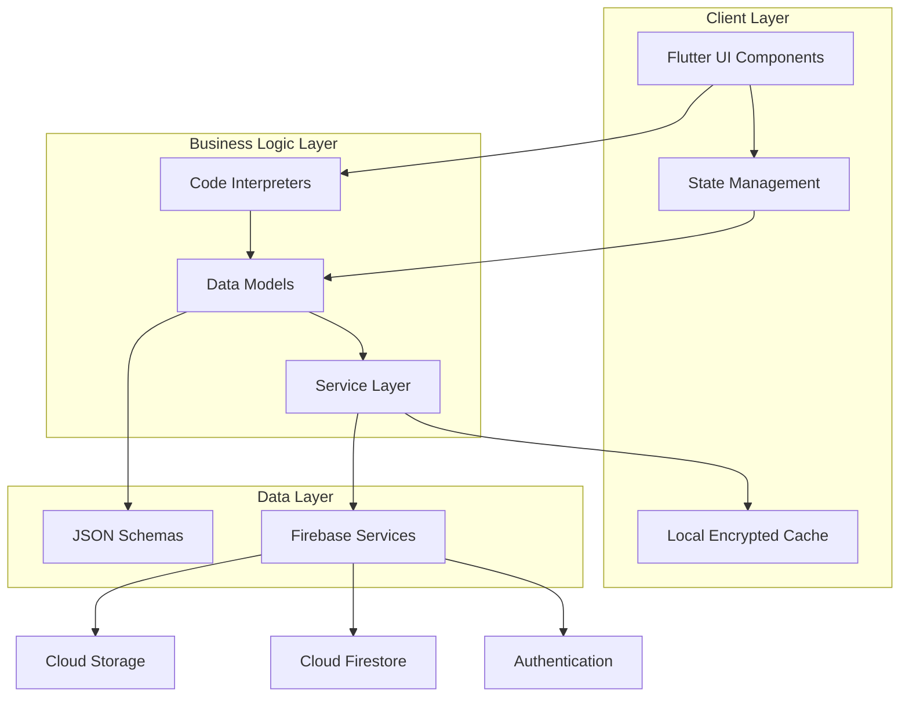

<div align="center">

# 🌱 Code Sprout

### *An Interactive Programming Education Platform with Gamified Farm Simulation*

[](https://flutter.dev)
[](https://dart.dev)
[](https://firebase.google.com)
[](LICENSE)

[📱 Download APK](../../releases/latest) • [📚 Documentation](.markdowns/) • [🎯 Features](#features) • [🚀 Getting Started](#getting-started)

</div>

---

## 👨‍💻 Author

**Lean Vince A. Cabales**  
Bachelor of Science in Computer Science  
Major in Artificial Intelligence  
West Visayas State University  
📧 Email: [levincabales40@gmail.com](levincabales40@gmail.com)  
🔗 GitHub: [@IamLevin40](https://github.com/IamLevin40)

---

## 📖 Overview

Code Sprout is an innovative mobile and desktop application that revolutionizes programming education by integrating traditional lecture-based learning with an engaging gamified farm simulation. The platform makes abstract programming concepts tangible through practical application, allowing learners to automate virtual farming operations using real code in multiple programming languages.

### 🎯 Core Concept

Learning programming through **doing** rather than just reading. Students write actual code to control a virtual farming drone, watching their programs come to life as they plant crops, harvest resources, and optimize farming operations. This immediate visual feedback reinforces learning and makes programming concepts concrete and memorable.

### ✨ Key Highlights

- 🖥️ **Multi-Language Support**: Learn Python, JavaScript, C++, C#, and Java
- 🎮 **Gamified Learning**: Progress through ranks, unlock features, and earn achievements
- 🌾 **Farm Simulation**: Apply programming skills to real-world-like scenarios
- 📚 **Structured Curriculum**: Progressive modules from basics to advanced concepts
- 🔄 **Offline-First**: Learn anywhere with automatic cloud synchronization
- 🎨 **Interactive Exercises**: Multiple learning modalities including lectures, quizzes, and code challenges
- 🔬 **Research System**: Unlock new features and expand capabilities through progression
- 🏆 **Rank Progression**: Track mastery through experience points and rank advancement

---

## 🏗️ System Architecture

<div align="center">



**Three-Tier Architecture**: Presentation • Business Logic • Data Access

</div>

---

## 🎮 Features

### 📚 Educational Features

- **Multi-Modal Learning**: Lectures, multiple choice, true/false, fill-in-the-code, assemble-the-code
- **Five Programming Languages**: Python, JavaScript, C++, C#, Java with custom interpreters
- **Progressive Difficulty**: Structured modules building from fundamentals to advanced concepts
- **Immediate Feedback**: Real-time code execution with visual results
- **Comprehensive Error Reporting**: Detailed error messages with line highlighting

### 🌾 Farm Simulation

- **Grid-Based Environment**: Expandable farm plots for crop cultivation
- **Crop Management**: Multiple crop types with realistic growth cycles
- **Drone Automation**: Program a virtual drone to automate farming tasks
- **Resource Economy**: Manage seeds, crops, and coins strategically
- **Visual Feedback**: Watch your code execute with animated farm changes

### 🔬 Research & Progression

- **Technology Tree**: Unlock new features through research
- **Three Research Branches**: Crop research, farm research, functions research
- **Prerequisite System**: Structured progression requiring foundational knowledge
- **Resource Investment**: Use farming proceeds to fund research

### 💾 Technical Features

- **Cache-First Architecture**: Instant loading with background synchronization
- **Offline Functionality**: Full feature access without internet connection
- **Cross-Platform**: iOS, Android, Windows, macOS, Web support
- **Encrypted Storage**: AES-256 encryption for local data
- **Automatic Migration**: Seamless updates preserving user progress
- **Schema-Driven**: Flexible data structures enabling easy content updates

---

## 📁 Project Structure

```
code_sprout/
├── 📱 android/              # Android platform configuration
├── 🍎 ios/                  # iOS platform configuration  
├── 🪟 windows/              # Windows platform configuration
├── 🖥️ macos/                # macOS platform configuration
├── 🌐 web/                  # Web platform configuration
├── 🐧 linux/                # Linux platform configuration
│
├── 📦 assets/               # Application assets
│   ├── images/             # Icons, sprites, and graphics
│   │   ├── crops/         # Crop growth stage sprites
│   │   └── icons/         # UI icons and graphics
│   ├── schemas/           # JSON schema definitions
│   │   ├── courses/       # Course content schemas
│   │   └── researches/    # Research item schemas
│   └── references/        # Template and reference files
│
├── 📚 lib/                  # Main application source code
│   ├── main.dart          # Application entry point
│   │
│   ├── 📱 pages/           # Application screens
│   │   ├── login_page.dart
│   │   ├── register_page.dart
│   │   ├── home_page.dart
│   │   ├── courses_page.dart
│   │   ├── module_levels_page.dart
│   │   ├── farm_page.dart
│   │   └── sprout_page.dart
│   │
│   ├── 🧩 widgets/         # Reusable UI components
│   │   ├── course_cards/
│   │   ├── farm_items/
│   │   ├── level_contents/
│   │   ├── level_popups/
│   │   ├── module_items/
│   │   ├── research_cards/
│   │   ├── settings_items/
│   │   └── sprout_items/
│   │
│   ├── 📊 models/          # Data models and schemas
│   │   ├── user_data.dart
│   │   ├── user_data_schema.dart
│   │   ├── farm_data.dart
│   │   ├── farm_data_schema.dart
│   │   ├── course_data.dart
│   │   ├── course_data_schema.dart
│   │   ├── research_data.dart
│   │   ├── research_items_schema.dart
│   │   ├── inventory_data.dart
│   │   ├── rank_data.dart
│   │   └── styles_schema.dart
│   │
│   ├── 🔧 services/        # Business logic services
│   │   ├── auth_service.dart
│   │   ├── firestore_service.dart
│   │   ├── local_storage_service.dart
│   │   └── farm_progress_service.dart
│   │
│   ├── 🤖 compilers/       # Code interpreters
│   │   ├── base_interpreter.dart
│   │   ├── python_interpreter.dart
│   │   ├── javascript_interpreter.dart
│   │   ├── cpp_interpreter.dart
│   │   ├── csharp_interpreter.dart
│   │   └── java_interpreter.dart
│   │
│   └── 🛠️ miscellaneous/   # Utility functions
│       ├── handle_code_editing.dart
│       ├── handle_code_execution.dart
│       ├── handle_farm_progress.dart
│       ├── handle_research_progress.dart
│       └── interactive_viewport_controller.dart
│
├── 🧪 test/                 # Unit and widget tests
│   ├── interpreter_test.dart
│   ├── farm_progress_service_test.dart
│   ├── research_system_test.dart
│   └── ...
│
├── 📄 .markdowns/          # Documentation
│   ├── APP_DESCRIPTION_AND_OBJECTIVES.md
│   ├── SYSTEM_FEATURES.md
│   ├── DATA_FLOW_AND_MODEL_SERVICES.md
│   ├── CHALLENGES_CONCLUSIONS_FUTURE_DEVELOPMENTS.md
│   ├── USER_AUTHENTICATION.md
│   └── app_documents/
│       └── APK_BUILD_INSTRUCTIONS.md
│
├── 🔧 Configuration Files
│   ├── pubspec.yaml        # Flutter dependencies
│   ├── analysis_options.yaml
│   ├── firebase.json
│   ├── firestore.rules
│   └── README.md           # This file
│
└── 🔐 Security Files
    ├── .gitignore
    ├── key.properties
    └── google-services.json
```

---

## 📚 Documentation

Comprehensive documentation is available in the `.markdowns` directory:

<div align="center">

| Document | Description | Link |
|----------|-------------|------|
| 📱 **App Description & Objectives** | Detailed overview, features, and educational objectives | [Read More](.markdowns/project_documents/APP_DESCRIPTION_AND_OBJECTIVES.md) |
| ⚙️ **System Features** | Complete feature documentation and implementation details | [Read More](.markdowns/project_documents/SYSTEM_FEATURES.md) |
| 🔄 **Data Flow & Services** | Architecture, models, and service layer explanation | [Read More](.markdowns/project_documents/DATA_FLOW_AND_MODEL_SERVICES.md) |
| 🔐 **User Authentication** | Authentication system and data management | [Read More](.markdowns/app_documents/USER_AUTHENTICATION.md) |
| 🎯 **Challenges & Future Work** | Limitations, conclusions, and future developments | [Read More](.markdowns/project_documents/CHALLENGES_CONCLUSIONS_FUTURE_DEVELOPMENTS.md) |
| 📦 **APK Build Instructions** | Step-by-step guide for building Android APK | [Read More](.markdowns/app_documents/APK_BUILD_INSTRUCTIONS.md) |

</div>

---

## 🚀 Getting Started

### Prerequisites

- **Flutter SDK**: 3.5.4 or higher ([Install Flutter](https://flutter.dev/docs/get-started/install))
- **Dart SDK**: 3.5.4 or higher (included with Flutter)
- **Android Studio** or **VS Code** with Flutter extensions
- **Git**: For version control
- **Firebase Account**: For backend services ([Firebase Console](https://console.firebase.google.com))

### Installation

1. **Clone the repository**
   ```bash
   git clone https://github.com/IamLevin40/Code-Sprout.git
   cd Code-Sprout/code_sprout
   ```

2. **Install dependencies**
   ```bash
   flutter pub get
   ```

3. **Configure Firebase**
   - Create a new Firebase project
   - Add Android/iOS/Web apps in Firebase Console
   - Download and place `google-services.json` (Android) and `GoogleService-Info.plist` (iOS)
   - Update `firebase_options.dart` with your configuration

4. **Run the application**
   ```bash
   # For development
   flutter run
   
   # For specific platform
   flutter run -d chrome        # Web
   flutter run -d windows       # Windows
   flutter run -d macos         # macOS
   ```

5. **Build for release**
   ```bash
   # Android APK
   flutter build apk --release
   
   # iOS
   flutter build ios --release
   
   # Windows
   flutter build windows --release
   ```

### Configuration Files

**Firebase Configuration** (`lib/firebase_options.dart`):
```dart
// Generated by FlutterFire CLI
// Configure with your Firebase project credentials
```

**Environment Variables** (Optional `key.properties`):
```properties
storePassword=your_store_password
keyPassword=your_key_password
keyAlias=your_key_alias
storeFile=path_to_keystore.jks
```

---

## 📥 Download

### Latest Release

<div align="center">

[](../../releases/latest)

Get the latest Android APK from [GitHub Releases](../../releases/latest)

</div>

### Platform Availability

| Platform | Status | Download |
|----------|--------|----------|
| 🤖 **Android** | ✅ Available | [APK Download](../../releases/latest) |
| 🍎 **iOS** | 🚧 Coming Soon | Build from source |
| 🪟 **Windows** | ✅ Available | Build from source |
| 🖥️ **macOS** | ✅ Available | Build from source |
| 🌐 **Web** | ✅ Available | [Live Demo](https://your-web-url.web.app) |

---

## 🧪 Testing

Run the comprehensive test suite:

```bash
# Run all tests
flutter test

# Run specific test file
flutter test test/interpreter_test.dart

# Run tests with coverage
flutter test --coverage
```

### Test Coverage

- ✅ Code Interpreters (Python, JavaScript, C++, C#, Java)
- ✅ Farm Progress Service
- ✅ Research System
- ✅ User Data Management
- ✅ Widget Components
- ✅ Interactive Viewport

---

## 🛡️ Security & Privacy

### Data Protection

- **AES-256 Encryption**: All local data encrypted at rest
- **Firebase Authentication**: Industry-standard user authentication
- **Secure Storage**: Platform-specific secure storage (iOS Keychain, Android Keystore)
- **HTTPS Communication**: All network traffic encrypted in transit

### Privacy Commitment

Code Sprout is committed to protecting user privacy:

- ✅ Minimal data collection (email, progress data only)
- ✅ No third-party analytics or advertising
- ✅ User data never sold or shared
- ✅ Full data export and deletion available
- ✅ GDPR and privacy law compliant

For complete details, see [Terms and Conditions](#terms-and-conditions).

---

## 📜 Terms and Conditions

### License

This project is licensed under the MIT License - see the [LICENSE](LICENSE) file for details.

### Terms of Use

**Effective Date**: November 28, 2025

By using Code Sprout, you agree to the following terms:

#### 1. Acceptance of Terms

By accessing and using Code Sprout ("the Application"), you accept and agree to be bound by these Terms and Conditions. If you do not agree, please do not use the Application.

#### 2. Educational Purpose

Code Sprout is provided as an educational tool for learning programming concepts. The Application is not intended as a substitute for formal computer science education or professional development resources.

#### 3. User Accounts

- You must provide accurate registration information
- You are responsible for maintaining account security
- One account per user; account sharing is prohibited
- Accounts may be terminated for terms violations

#### 4. User Content and Data

- You retain ownership of code you create
- We store your progress data to provide the service
- We may analyze anonymized usage data to improve the Application
- You may request data export or deletion at any time

#### 5. Acceptable Use

You agree NOT to:
- Use the Application for illegal activities
- Attempt to compromise Application security
- Reverse engineer or decompile the Application
- Share accounts or credentials with others
- Upload malicious code or harmful content

#### 6. Intellectual Property

- The Application, content, and materials are owned by the author
- Course content and educational materials are proprietary
- User-generated code belongs to the user
- Application name and branding are protected trademarks

#### 7. Service Availability

- The Application is provided "as is" without warranties
- We strive for continuous availability but cannot guarantee 100% uptime
- Features may change or be discontinued with notice
- We reserve the right to modify or terminate services

#### 8. Limitation of Liability

The Application and its creators are not liable for:
- Data loss or corruption
- Service interruptions
- Indirect or consequential damages
- Third-party content or services

#### 9. Privacy and Data Protection

- We collect minimal data necessary for functionality
- Data is encrypted and stored securely
- We comply with GDPR and applicable privacy laws
- See our [Privacy Policy](#privacy-policy) for details

#### 10. Changes to Terms

We reserve the right to modify these terms. Users will be notified of significant changes. Continued use after changes constitutes acceptance.

#### 11. Termination

We may terminate or suspend accounts for:
- Terms violations
- Fraudulent activity
- Extended inactivity
- Legal requirements

#### 12. Governing Law

These terms are governed by applicable laws of the Philippines.

#### 13. Contact

For questions about these terms:
- **Email**: [contact@example.com](mailto:contact@example.com)
- **GitHub**: [Open an issue](../../issues)

### Privacy Policy

**Last Updated**: November 28, 2025

#### Information We Collect

**Personal Information**:
- Email address (for authentication)
- Username (for identification)

**Usage Data**:
- Course progress and completion status
- Farm simulation state
- Research completion records
- Experience points and rank information
- Code execution logs (stored locally only)

**Automatically Collected**:
- Device type and operating system
- Application version
- Crash reports and error logs

#### How We Use Information

- **Service Provision**: Enable core application functionality
- **Progress Tracking**: Save and synchronize learning progress
- **Improvement**: Analyze usage patterns to enhance features
- **Support**: Respond to user inquiries and issues
- **Security**: Detect and prevent fraudulent activity

#### Data Storage and Security

- **Encryption**: AES-256 for local data, TLS for transmission
- **Cloud Storage**: Firebase Firestore with security rules
- **Access Control**: Data accessible only to authenticated user
- **Retention**: Data retained while account is active
- **Deletion**: Users may request complete data deletion

#### Data Sharing

We do NOT:
- Sell user data to third parties
- Share data with advertisers
- Use data for marketing purposes
- Provide data to external analytics services

We MAY share data:
- When required by law
- To protect rights and safety
- With explicit user consent

#### User Rights

You have the right to:
- ✅ Access your personal data
- ✅ Correct inaccurate information
- ✅ Request data deletion
- ✅ Export your data
- ✅ Withdraw consent
- ✅ Object to processing

#### Children's Privacy

Code Sprout is intended for users 13 years and older. We do not knowingly collect data from children under 13. Parents discovering such collection should contact us for immediate removal.

#### International Data Transfer

Data may be transferred to and stored in different countries. We ensure appropriate safeguards comply with data protection regulations.

#### Changes to Privacy Policy

We may update this policy. Users will be notified of material changes through the Application or email.

---

## 🤝 Contributing

Contributions are welcome! Here's how you can help:

### Reporting Issues

1. Check [existing issues](../../issues) to avoid duplicates
2. Use issue templates when available
3. Provide detailed reproduction steps
4. Include screenshots or error messages

### Pull Requests

1. Fork the repository
2. Create a feature branch (`git checkout -b feature/AmazingFeature`)
3. Commit changes (`git commit -m 'Add some AmazingFeature'`)
4. Push to branch (`git push origin feature/AmazingFeature`)
5. Open a Pull Request

### Development Guidelines

- Follow Dart/Flutter style guidelines
- Add tests for new features
- Update documentation as needed
- Ensure all tests pass before submitting

---

## 🙏 Acknowledgments

### Technologies Used

- **[Flutter](https://flutter.dev)** - UI framework
- **[Firebase](https://firebase.google.com)** - Backend services
- **[Dart](https://dart.dev)** - Programming language
- **[Flutter Secure Storage](https://pub.dev/packages/flutter_secure_storage)** - Encrypted storage

### Inspiration

This project draws inspiration from:
- Constructionist learning theory (Seymour Papert)
- Gamification in education research
- Real-world programming education challenges
- Student feedback and learning preferences

### Special Thanks

- West Visayas State University Computer Science Department
- Open source community contributors
- Early testers and feedback providers

---

## 📞 Contact & Support

### Get Help

- 📧 **Email**: [levincabales40@gmail.com](levincabales40@gmail.com)
- 🐛 **Bug Reports**: [GitHub Issues](../../issues)
- 💬 **Discussions**: [GitHub Discussions](../../discussions)
- 📚 **Documentation**: [Wiki](../../wiki)

---

## 📊 Project Status


### Roadmap

- [x] ✅ Core platform development
- [x] ✅ Multi-language interpreter implementation
- [x] ✅ Farm simulation system
- [x] ✅ Research and progression features
- [x] ✅ Cross-platform support
- [ ] 🚧 Advanced debugging tools
- [ ] 🚧 Social learning features
- [ ] 🚧 Additional programming languages
- [ ] 📋 AI-powered tutoring assistance
- [ ] 📋 Virtual reality integration

---

## 📈 Statistics

<div align="center">


</div>

---

<div align="center">

### ⭐ Star this repository if you find it helpful!

**Made with ❤️ by [Lean Vince A. Cabales](https://github.com/IamLevin40)**

**West Visayas State University • 2025**

[⬆ Back to Top](#-code-sprout)

</div>

